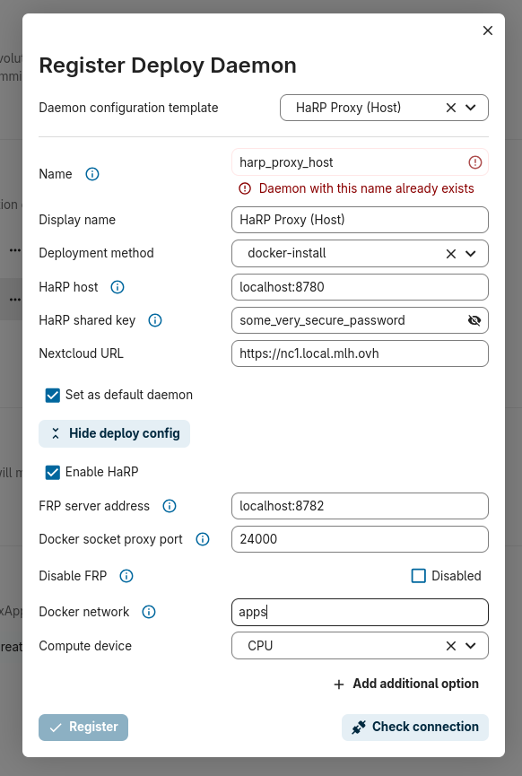

# AppAPI

## Docker Socket Proxy

**Note:** AppAPI via Docker Socket Proxy will be deprecated sooner or later. Using [HaRP](#harp) instead is now advised.

**Warning:** currently, it is not possible to run several AppAPI docker socket proxy on the same docker host or as a shared component between several Nextcloud instances, because exApps names would conflict. There is a public Github issue about it [there](https://github.com/nextcloud/app_api/issues/523). So until this is fixed, you can only have one test instance connected to the docker socket proxy.

## Run the container

```sh
docker run -e NC_HAPROXY_PASSWORD="nextcloud" \
  -v /var/run/docker.sock:/var/run/docker.sock \
  --name appapi -h appapi \
  --restart unless-stopped \
  --privileged \
  --network apps \
  -d ghcr.io/nextcloud/nextcloud-appapi-dsp:release
```

_NB: I removed this part as it seems not to be needed `-e EX_APPS_NET="ipv4@172.19.0.1" \`. However, when installing Flow, I notice that Flow publishes port 8000, so I wonder if their is an interest to keep or not the environment variable. So far, it works without for me._

To stop the container:
```sh
docker stop appapi && docker rm appapi
```

## Connect your Nextcloud instance

- Disaply Name: `Docker Socket Proxy`
- Deployment method: `docker-install`
- Daemon host: `appapi:2375` (`appapi` being the name of the AppAPI container stated in the `docker run` command)
- Nextcloud URL: Nextcloud URL 🙃
- Network: specify the docker network name, in our case `apps`
- HA Proxy password: in our case `nextcloud`
- Compute device: CPU, unless you have a GPU :)

Once configured, you can click the three dots and `Test deploy`. Launch the test, the docker pull image might stay stucked at 76% and a yellow warning may pop up, but wait a bit, and the test should finish all fine.

Then, you can install the Flow app. I always struggle a bit to find it in the app store, so here is the path: select the `Tools` category, and search for `Flow`. It should appear. I don't know why it does not show up in the `Flow` category, nor pops up when you search in the whole app list :/

## HaRP

**Note:** HaRP is the replacement for the previous Docker Socket Proxy. It is the recommended component to deploy ExApps from Nextcloud 32 onward.

Start the HaRP with the following command. Tune the few parameters according to your setup (URL, password, docker network...)

```sh
docker run \
  -e HP_SHARED_KEY="some_very_secure_password" \
  -e NC_INSTANCE_URL="https://nc1.local.mlh.ovh" \
  -e HP_TRUSTED_PROXY_IPS="172.18.0.0/16,127.0.0.1" \
  -e HP_FRP_DISABLE_TLS="true" \
  -v /var/run/docker.sock:/var/run/docker.sock \
  --name appapi-harp -h appapi-harp \
  --network apps \
  --restart unless-stopped \
  -p 8780:8780 \
  -p 8782:8782 \
  -d ghcr.io/nextcloud/nextcloud-appapi-harp:release
```

Add the following to your `nextcloud.conf` reverse proxy configuration file:

```conf
    location /exapps/ {
        proxy_pass $appapi;
        proxy_set_header Host $host;
        proxy_set_header X-Real-IP $remote_addr;
        proxy_set_header X-Forwarded-For $proxy_add_x_forwarded_for;
        proxy_set_header X-Forwarded-Proto $scheme;
    }
```

and update in the same file the variable declaration that depends on hostname. Below I added the `set $appapi http://appapi-harp:8780;` line.

```conf
    if ($host = nc1.local.mlh.ovh) {
        set $nextcloud http://nc1-nextcloud-1;
        set $push http://nc1-push-1:7867;
        set $appapi http://appapi-harp:8780;
    }
```

And restart the reverse proxy:

```sh
docker restart reverseproxy
```

Then, go to `Nextcloud admin interface > AppAPI > Register daemon` and fill the fields as follow:



Check the connection, save, click the three dots menu and hit `Test deploy`.

## Troubleshooting

If test deploy fails, checking the logs of all components involved is useful:
- check for 404 or 502 in `docker logs -f reverseproxy`
- check for error messages in `docker logs -f appapi-harp` and `docker logs -f nc_app_test-deploy`
- check for AppAPI related error messages in nextcloud docker logs and in `Nextcloud admin interface > Logging`
